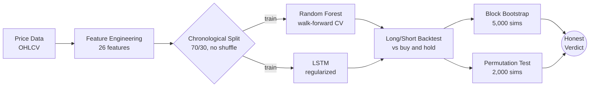

<div align="center">

# 📈 Stock Return Predictor

**Random Forest & LSTM models for next-day stock return prediction — backtested as a long/short strategy, then stress-tested with Monte Carlo resampling instead of trusting one lucky-looking equity curve.**

[](https://www.python.org/)
[](https://scikit-learn.org/)
[](https://pytorch.org/)
[](LICENSE)
[](#disclaimer)

</div>

<br>

<table>
<tr>
<td width="50%"></td>
<td width="50%"></td>
</tr>
<tr>
<td align="center"><sub>What most backtest repos show you: <b>one</b> equity curve.</sub></td>
<td align="center"><sub>What this repo shows you: the <b>5,000-simulation</b> distribution behind it.</sub></td>
</tr>
</table>

## Most ML-trading repos show you one backtest. This one shows you 5,000.

Search GitHub for "stock prediction LSTM" and the pattern repeats: pull some
prices, engineer a few features, train a model, plot one gorgeous equity
curve, ship it. That curve is a single draw from a distribution of things
that could have happened, and it's usually the only draw anyone shows you.

This repo predicts next-day returns the same way those do — but before any
result is allowed to count as a finding, it's run through a 5,000-simulation
block bootstrap and a 2,000-run permutation test against pure noise. When
the honest answer is *"this doesn't actually beat buy-and-hold,"* that's
what gets reported, with the statistics to back it up — not a cherry-picked
window that hides it.

<br>

<table align="center">
<tr><th></th><th align="center">R² (test)</th><th align="center">Backtest return</th><th align="center">P(beats buy&nbsp;&amp;&nbsp;hold)*</th></tr>
<tr><td>Buy &amp; hold</td><td align="center">—</td><td align="center"><b>+31.4%</b></td><td align="center">—</td></tr>
<tr><td>Random Forest long/short</td><td align="center">−2.6%</td><td align="center">−20.9%</td><td align="center">0.7%</td></tr>
<tr><td>LSTM long/short</td><td align="center">−5.0%</td><td align="center">+10.3%</td><td align="center">13.4%</td></tr>
</table>
<p align="center"><sub>* From 5,000-simulation block bootstrap, not the single realized path. Full numbers in <a href="docs/RESULTS.md">docs/RESULTS.md</a>.</sub></p>

---

## Contents

- [How it works](#how-it-works)
- [Quickstart](#quickstart)
- [What's inside](#whats-inside)
- [Key design choices](#key-design-choices)
- [Results](#results)
- [Limitations](#limitations)
- [Roadmap](#roadmap)
- [References](#references)
- [Disclaimer](#disclaimer)
- [Contributing](#contributing) · [License](#license)

## How it works



## Quickstart

```bash
git clone https://github.com/<your-username>/stock-return-predictor.git
cd stock-return-predictor
pip install -r requirements.txt
python3 main.py
```

Runs end to end in a couple of minutes on CPU: pulls data, engineers
features, trains both models, backtests, runs the Monte Carlo evaluation,
and writes every chart to `figures/` and every metric to
`outputs/results.json`.

Point it at a different ticker or a longer history in `src/config.py`:

```python
TICKER = "MSFT"
START_DATE = "2010-01-01"
DATA_SOURCE = "yfinance"   # 'auto' | 'yfinance' | 'local_csv'
```

## What's inside

```
stock_return_predictor/
├── main.py                    # runs the entire pipeline end to end
├── requirements.txt
├── src/
│   ├── config.py               # every tunable parameter lives here
│   ├── data_loader.py          # yfinance, with automatic local-CSV fallback
│   ├── features.py             # SMA, lagged returns, RSI, rolling vol, +extras
│   ├── model.py                # Random Forest + LSTM, walk-forward CV
│   ├── backtest.py             # long/short engine, transaction costs
│   ├── monte_carlo.py          # block bootstrap + permutation test
│   └── plotting.py
├── data/                       # bundled real fallback dataset
├── figures/                    # all charts, regenerated on every run
├── outputs/                    # results.json + raw backtest / MC series (CSV)
└── docs/
    └── RESULTS.md              # full methodology + results write-up
```

## Key design choices

- **No shuffling, anywhere.** Not the train/test split, not cross-validation
  (`sklearn.TimeSeriesSplit`, expanding-window), not the LSTM's mini-batches.
- **Hyperparameters are chosen by validation performance, never test
  performance.** The test set is touched exactly once, after every model is
  frozen. (The LSTM's regularization — dropout, weight decay, gradient
  clipping — was tuned this way; an earlier, unregularized version scored
  test R² ≈ −8.7 by memorizing training noise. Worth knowing what that looks
  like before you ship a model that's done it.)
- **R² is benchmarked against zero, not the historical mean** (Gu, Kelly &
  Xiu, 2020) — demeaning the target would leak look-ahead information a live
  trader wouldn't have.
- **Transaction costs are real.** 5 bps per unit of position change, charged
  on every trade, in both the single-path backtest and every Monte Carlo
  simulation.
- **The block bootstrap preserves autocorrelation.** Returns are resampled
  in contiguous 15-day blocks, not shuffled independently, so volatility
  clustering survives the resample.
- **The permutation test isolates *timing* skill from *call-quality*.**
  Reshuffling a model's own realized long/short calls into random order
  answers a different question than the bootstrap does — see
  [`docs/RESULTS.md`](docs/RESULTS.md) for why that distinction mattered
  here.

## Results

The condensed version is in the table up top. The full write-up —
exact feature and backtest mechanics, every Monte Carlo number, feature
importance, and how the results connect to the empirical asset-pricing and
financial-ML literature this project draws on — is in
**[`docs/RESULTS.md`](docs/RESULTS.md)**.

The one-sentence version: on the real (not synthetic) two-year AAPL sample
shipped in this repo, neither model shows real predictive skill, and the
Monte Carlo layer confirms this isn't just an unlucky single path — it's
worth reading *why*, because the reasons are the same handful of pitfalls
that sink most "AI stock predictor" projects once they leave the backtest.

## Limitations

Short version — sample size (456 rows, one 137-day test window), single
asset, single market regime, naive fixed-horizon labeling, no
purged/embargoed cross-validation, flat transaction-cost assumption, and a
technical-indicators-only feature set. Every one of these is a lever you can
pull; see [`docs/RESULTS.md`](docs/RESULTS.md#limitations--how-this-could-fail-live)
for the full discussion and what each would take to fix.

## Roadmap

- [ ] Multi-year, multi-regime data via `yfinance` (one-line config change)
- [ ] Cross-sectional pooling across a ticker universe, not one stock at a time
- [ ] Purged & embargoed cross-validation
- [ ] Meta-labeling / confidence-weighted position sizing
- [ ] Sensitivity analysis across block-bootstrap window lengths

## References

This project was built around four resources — the pipeline's design
choices trace directly back to points each one makes:

- Gu, S., Kelly, B., & Xiu, D. (2020). *Empirical Asset Pricing via Machine
  Learning*. Review of Financial Studies, 33(5), 2223–2273.
  [academic.oup.com](https://academic.oup.com/rfs/article-abstract/33/5/2223/5758276)
- López de Prado, M. *The 10 Reasons Most Machine Learning Funds Fail*.
  [papers.ssrn.com](https://papers.ssrn.com/sol3/papers.cfm?abstract_id=3104816)
- Jansen, S. *Machine Learning for Trading* (GitHub).
  [github.com/stefan-jansen](https://github.com/stefan-jansen/machine-learning-for-trading)
- QuantStart. *Forecasting Financial Time Series — Part 1*.
  [quantstart.com](https://www.quantstart.com/articles/Forecasting-Financial-Time-Series-Part-1/)

## Disclaimer

This is a research and educational project, not investment advice. Nothing
here is a recommendation to buy, sell, or hold any security. Past
performance — simulated, backtested, or otherwise — does not indicate
future results. The headline finding of this project is literally that its
own long/short strategy doesn't reliably beat buy-and-hold; trade at your
own risk and do your own research.

## Contributing

Issues and pull requests are welcome — extensions from the
[Roadmap](#roadmap) are a good place to start.

## License

[MIT](LICENSE)
