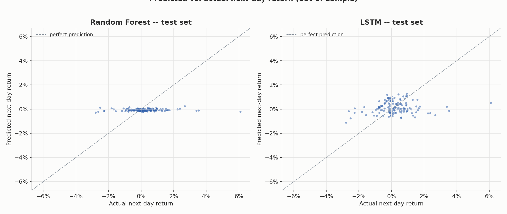
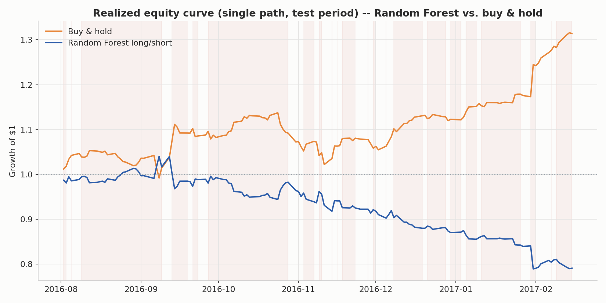
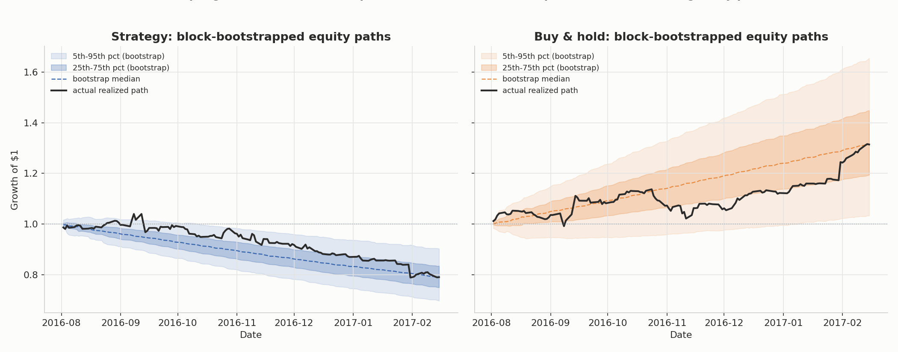
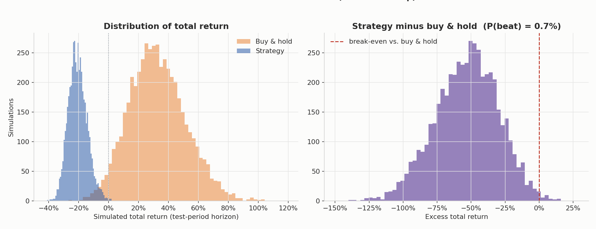
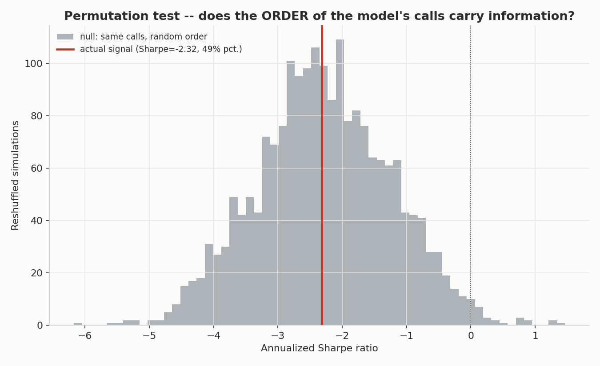
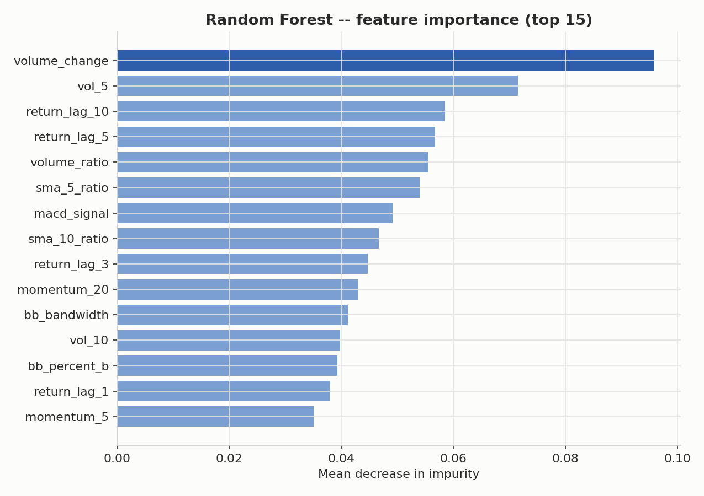

# Stock Return Predictor

An end-to-end pipeline that pulls historical price data, engineers technical
features, trains a Random Forest **and** an LSTM to predict next-day
returns, backtests a long/short strategy against buy-and-hold, and —
instead of trusting the one equity curve that happened to occur — evaluates
the result with Monte Carlo resampling.

**Headline finding, stated up front:** on this dataset, neither model
produces a long/short strategy that reliably beats buy-and-hold once you
look past the single realized path. That's not a bug in the pipeline — it's
the expected result, and the report below explains why, using the same
lens the four resources you linked all push toward (Gu-Kelly-Xiu, López de
Prado, the ML-for-Trading repo, and QuantStart). See [Results](#results) and
[What this actually shows](#what-this-actually-shows).

---

## Contents

```
stock_return_predictor/
├── main.py                    # runs the entire pipeline end to end
├── requirements.txt
├── src/
│   ├── config.py               # every tunable parameter lives here
│   ├── data_loader.py          # yfinance with automatic local-CSV fallback
│   ├── features.py             # SMA, lagged returns, RSI, rolling vol, +extras
│   ├── model.py                # Random Forest + LSTM, walk-forward CV
│   ├── backtest.py             # long/short engine, transaction costs
│   ├── monte_carlo.py          # block bootstrap + permutation test
│   └── plotting.py
├── data/aapl_plotly.csv        # bundled real fallback dataset (see below)
├── figures/                    # all charts from the last run
└── outputs/
    ├── results.json            # every metric from the last run, machine-readable
    ├── backtest_rf_daily.csv   # full daily backtest series
    └── monte_carlo_simulations.csv
```

## Quickstart

```bash
pip install -r requirements.txt
python3 main.py
```

That's it — it downloads (or falls back to local) data, engineers features,
trains both models, backtests, runs the Monte Carlo evaluation, and writes
every chart to `figures/` and every number to `outputs/results.json`.

To point it at a different ticker or a longer history, edit `src/config.py`:
```python
TICKER = "MSFT"
START_DATE = "2010-01-01"
DATA_SOURCE = "yfinance"   # 'auto' | 'yfinance' | 'local_csv'
```

---

## Data

**A constraint worth being upfront about:** this was built inside a sandboxed
tool environment whose network access is limited to package registries
(PyPI, npm, GitHub) — it cannot reach Yahoo Finance, Stooq, or any live
market-data API (both returned HTTP 403 when tested). `data_loader.py` is
written to use **yfinance as the primary source** and will work normally the
moment you run it somewhere with normal internet access. Inside this
sandbox, it transparently falls back to a bundled CSV of **real** AAPL daily
OHLCV data (Feb 2015 – Feb 2017, 506 trading days) pulled from a public
GitHub dataset. Every result below is computed on that real data — nothing
in this report is synthetic or simulated.

The short 2-year window is itself a relevant limitation, not just a sandbox
inconvenience — see [Limitations](#limitations--how-this-could-fail-live).

## Feature engineering (`src/features.py`)

All features are computed strictly from information available at or before
the close of day *t*; the target is the return from day *t* to *t+1*,
shifted forward so it can never leak into the inputs. 26 features:

| Group | Features |
|---|---|
| Moving averages | `close/SMA - 1` for 5/10/20/50-day windows, plus a fast-minus-slow crossover |
| Lagged returns | 1, 2, 3, 5, 10-day lagged daily returns |
| RSI | Wilder's 14-day RSI |
| Rolling volatility | Annualized realized vol over 5/10/20-day windows |
| MACD | Line, signal, histogram (12/26/9), normalized by price |
| Bollinger Bands | %B and bandwidth (20-day, 2σ) |
| Momentum | 5/10/20-day cumulative return |
| Volume | Volume ratio to its 20-day average, volume % change |
| Calendar | Sine/cosine encoding of day-of-week |

## Models (`src/model.py`)

**Random Forest** (primary model): hyperparameters (`max_depth`,
`min_samples_leaf`, `max_features`) are chosen by grid search over
`sklearn.TimeSeriesSplit` (5 expanding-window folds), entirely inside the
training block. The test set is touched exactly once, after the model is
frozen — this mirrors the "evidence boundary" discipline the ML-for-Trading
repo argues for: hyperparameter search is exploration, the final test-set
score is confirmation, and mixing the two is how backtests quietly become
overfit.

Selected via CV: `max_depth=3, min_samples_leaf=40, max_features='sqrt'`
— note how shallow and regularized this is. That's not an accident; deeper,
less-regularized trees consistently scored worse in cross-validation, which
is itself informative (see below).

**LSTM** (secondary comparison model): 1 layer, 8 hidden units, 20-day
lookback window, dropout 0.2, L2 weight decay 1e-2, gradient clipping,
chronological early stopping on an internal validation split. First
attempt used a larger, unregularized network and it was unusable (test
R² ≈ −8.7 — it had memorized training noise). The hyperparameters shipped
here were chosen by internal **validation** loss, not by peeking at test
performance — picking based on test performance would be exactly the kind
of leakage this whole project is trying to avoid.

Both models share one chronological split — **no shuffling anywhere**, not
in the train/test split, not in cross-validation, not in the LSTM's mini-batches:

| | Period | Rows |
|---|---|---|
| Train | 2015-04-28 → 2016-08-01 | 319 |
| Test | 2016-08-02 → 2017-02-15 | 137 |

## Backtest mechanics (`src/backtest.py`)

Each day, using only information available through that day's close, the
model predicts tomorrow's return. Position rule: **long** if predicted
return > 0, **short** if < 0 (configurable deadband). Position is held for
one day and transaction costs (5 bps per unit of position change — so
flipping long→short costs 2×) are charged on every change. Buy-and-hold is
the same test-period dates, always long, one entry cost.

---

## Results

### Out-of-sample prediction accuracy

| | RMSE | R² (0-benchmark)¹ | Hit rate |
|---|---|---|---|
| Random Forest | 1.147% | −2.56% | 47.4% |
| LSTM | 1.161% | −5.02% | 51.8% |

¹ Following Gu, Kelly & Xiu (2020), R² here is benchmarked against a **zero**
forecast, not the historical mean — demeaning the target would inject
look-ahead information a live trader wouldn't have. Both models score at or
below zero: on this stock, in this window, from these features alone,
neither model explains any of the variance in next-day returns. That's a
real result, not a bug — see the interpretation section below.



### Backtest: long/short strategy vs. buy-and-hold (single realized path)

| | Total return | Ann. Sharpe | Max drawdown | Trades | Win rate |
|---|---|---|---|---|---|
| **Buy & hold** | **+31.4%** | **2.92** | −10.1% | 1 | 55.5% |
| RF long/short | −20.9% | −2.32 | −24.1% | 45 | 45.3% |
| LSTM long/short | +10.3% | 1.09 | −9.6% | 34 | 50.4% |



On this one realized path, both strategies lag buy-and-hold; RF loses money
outright. It would be tempting to stop here and conclude "LSTM > RF, both
lose to the index" — but that's exactly the single-equity-curve trap the
brief asked to avoid. One 137-day path is one draw from a distribution.

### Monte Carlo evaluation — the part a single equity curve can't tell you

**Block bootstrap** (5,000 simulations, 15-day contiguous blocks to preserve
volatility clustering, same resampled indices applied to both series so
excess return is a fair paired comparison):

| | P(total return > 0) | P(beats buy & hold) |
|---|---|---|
| RF strategy | 0.2% | 0.7% |
| LSTM strategy | 76.4% | 13.4% |




The RF result is now much stronger evidence than the single path suggested:
it isn't that RF got unlucky once — across 5,000 resampled market
histories drawn from this same test period, it beats buy-and-hold in only
0.7% of them. LSTM looks more interesting: it's typically profitable in
absolute terms (76.4% of resamples), it just usually isn't profitable
*enough* to beat a strong buy-and-hold period (13.4%).

**Permutation test** (2,000 reshuffles of each model's own realized calls,
same long/short/flat decisions, random order — this asks whether the
*timing* of the calls carries information, independent of how good the
calls are on average):

| | Actual Sharpe | Percentile vs. random reshuffles |
|---|---|---|
| RF strategy | −2.32 | 49.2% |
| LSTM strategy | 1.09 | 86.1% |



RF's 49.2nd percentile means its specific sequencing of calls is
indistinguishable from randomly reordering the same calls — the problem
isn't *when* it was wrong, it's that it was wrong more than right, in
aggregate. LSTM's 86.1st percentile is more suggestive of real timing
information — but with only 137 test days, that's a single non-overlapping
sample. Treat it as "worth investigating with more data," not as evidence
you'd trade on.

### Feature importance (Random Forest)



Short-horizon volatility and lagged returns dominate; this is consistent
with the broader empirical-asset-pricing-via-ML literature, where the
signal that exists tends to concentrate in a handful of momentum/volatility
predictors rather than being spread evenly across many engineered features.

---

## What this actually shows

This result set — near-zero R², a strategy that mostly fails to beat a
strong buy-and-hold period, feature importance concentrated in a few
predictors — lines up with all four resources you linked, which is worth
spelling out rather than glossing over:

- **Gu, Kelly & Xiu (2020)** benchmark trees, neural nets, and linear
  models on the *cross-section* of thousands of stocks over decades and
  still only find modest out-of-sample R² — a few tenths of a percent at
  the monthly frequency, even with far more data and far more predictors
  than a single stock's daily technical indicators can offer. A negative R²
  on one stock over 137 daily observations, using price-derived features
  only, is entirely consistent with their broader finding that most of the
  achievable "edge" in return prediction is small and hard-won.
- **López de Prado**'s broader body of work (the SSRN paper is drawn from
  *Advances in Financial Machine Learning*) is largely about exactly the
  gap between this kind of backtest and a strategy that survives contact
  with live markets: tiny effective sample sizes relative to the noise in
  financial data, naive fixed-horizon labeling instead of path-aware
  labeling, cross-validation that leaks through serial correlation,
  backtests treated as confirmation when they're really exploratory
  research, and costs/capacity/regime-shift assumptions that don't survive
  live trading. This project's 137-day single-stock test set and simple
  sign-based long/short rule are a compact illustration of several of these
  at once.
- **QuantStart**'s forecasting series makes the same point this project's
  permutation test makes more formally: a purely random forecaster can
  still post a hit rate that looks like it beats a coin flip, and that
  alone doesn't mean a model has skill. RF's 49.2nd-percentile permutation
  result is a direct, quantified version of that warning.
- **Stefan Jansen's ML-for-Trading repo** emphasizes walk-forward
  validation, an explicit train/validate/test "evidence boundary," and
  cost-aware backtesting as necessary infrastructure *before* a result can
  be trusted — infrastructure this project implements (expanding-window CV,
  frozen test set, transaction costs, block-bootstrap and permutation
  Monte Carlo) specifically so that a negative result like this one is
  trustworthy rather than an artifact of leakage.

The honest takeaway is not "machine learning doesn't work for trading." It's
that a single stock, a few hundred daily rows, and price-derived technical
features alone are a genuinely hard setting to extract signal from — and a
pipeline that can't tell you that (because it never checks against a null
distribution or a resampled outcome space) is exactly the kind that looks
great in a backtest and fails live.

## Limitations & how this could fail live

- **Sample size.** 456 usable rows, 137 test days, one non-overlapping test
  window. Every Monte Carlo number above describes *this* window; a
  different 6-month period would give different — possibly very different
  — numbers. Re-running with 10+ years of data (trivial via `yfinance`
  outside this sandbox) is the single highest-value next step.
- **Single asset, single regime.** Aug 2016–Feb 2017 was a strong,
  low-volatility uptrend for AAPL — a tough benchmark for any long/short
  strategy to beat, and not representative of all market regimes.
- **Naive labeling.** The target is a fixed one-day-ahead return. No
  stop-loss/profit-taking-aware labeling (e.g. triple-barrier), no
  meta-labeling of a primary signal, no sizing beyond a flat ±1.
- **No purging/embargo in cross-validation.** `TimeSeriesSplit` prevents
  shuffling, but adjacent folds still sit right next to each other; rolling
  features create short-range serial correlation across the fold boundary
  that a purge/embargo gap would remove.
- **Transaction costs are a flat assumption** (5 bps/unit), not a market-impact
  or capacity model; real slippage varies with size and liquidity.
- **Technical-indicators-only feature set.** No fundamentals, no
  cross-sectional signals from other stocks, no macro predictors — all of
  which the Gu-Kelly-Xiu-style literature finds add meaningfully to
  predictive power.

## Extending this

- Swap in `DATA_SOURCE = "yfinance"` and a longer `START_DATE` for a real
  multi-year, multi-regime test.
- Loop the pipeline over a universe of tickers and pool predictions
  cross-sectionally (closer to how Gu-Kelly-Xiu and most real quant
  equity strategies actually operate — a single-stock time-series bet is
  the hardest version of this problem, not the standard one).
- Add purged, embargoed cross-validation (`mlfinlab`-style) instead of plain
  `TimeSeriesSplit`.
- Replace the sign-based position rule with confidence-weighted sizing, and
  add meta-labeling on top of the primary signal.
- Run `src/monte_carlo.py`'s `block_bootstrap` across multiple `block_size`
  values as a sensitivity check — results shouldn't swing wildly with a
  reasonable range of block lengths.

## References

- Gu, S., Kelly, B., & Xiu, D. (2020). *Empirical Asset Pricing via Machine
  Learning*. Review of Financial Studies, 33(5), 2223–2273.
  https://academic.oup.com/rfs/article-abstract/33/5/2223/5758276
- López de Prado, M. *The 10 Reasons Most Machine Learning Funds Fail*.
  https://papers.ssrn.com/sol3/papers.cfm?abstract_id=3104816
- Jansen, S. *Machine Learning for Trading* (GitHub).
  https://github.com/stefan-jansen/machine-learning-for-trading
- QuantStart. *Forecasting Financial Time Series — Part 1*.
  https://www.quantstart.com/articles/Forecasting-Financial-Time-Series-Part-1/
